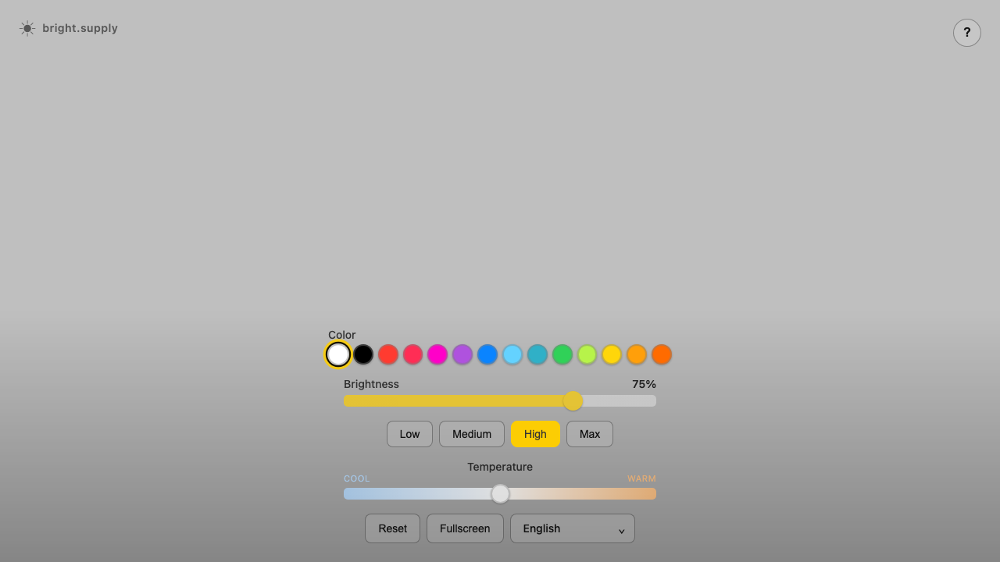

# bright.supply

[](https://bright.supply)
[](https://github.com/banastas/bright.supply/actions/workflows/ci.yml)
[](https://developer.mozilla.org/en-US/docs/Web/JavaScript)
[](LICENSE)



Turn any monitor, tablet, or phone into an adjustable fullscreen light.

[bright.supply](https://bright.supply) is a free, installable web app for video calls, photography, streaming, ambience, display testing, and creative work. Choose white or one of 13 vivid colors, adjust the intensity, and dedicate the whole display to light output. There is no account, download, or sign-up.

## Use it

1. Open [bright.supply](https://bright.supply) on the screen you want to use as a light.
2. Choose a color and adjust its brightness. White also includes a cool-to-warm temperature control.
3. Select **Fullscreen** for the largest possible light surface.

Low, Medium, High, and Max set brightness to 20, 50, 75, and 100 percent. Presets can be launched from a URL:

```text
https://bright.supply/white/?preset=max
https://bright.supply/blue/?preset=medium
https://bright.supply/es/orange/?preset=low
```

## Features

- Fourteen direct, shareable screen-color routes
- Brightness control for every light-emitting color
- Cool-to-warm white balance on the home and white routes
- Fullscreen mode, keyboard shortcuts, and saved local settings
- A true black route without controls that cannot affect black
- Eighteen localized editions, including Arabic right-to-left layout
- Installable PWA behavior and route-aware offline caching
- Accessible labels, focus states, touch targets, and adaptive text contrast
- Production-only, privacy-conscious GA4 interaction measurement
- Pure HTML, CSS, and JavaScript with no package dependencies

Every color has a stable English URL such as [`/white/`](https://bright.supply/white/), [`/red/`](https://bright.supply/red/), or [`/black/`](https://bright.supply/black/). Localized routes put the language first, such as [`/es/orange/`](https://bright.supply/es/orange/) or [`/ar/blue/`](https://bright.supply/ar/blue/). The language picker preserves the selected color.

## Keyboard shortcuts

| Key | Action |
|---|---|
| `←` / `→` | Decrease or increase brightness by 5 percent |
| `Space` | Toggle between the current and previous brightness |
| `R` | Reset brightness and white balance |
| `F` | Toggle fullscreen |
| `H` | Toggle keyboard help |
| `1` to `4` | Select Low, Medium, High, or Max |

Shortcuts do not intercept input, select, or button interactions.

## How the repository works

The repository contains 270 generated HTML documents: 15 page types across 18 languages. Each one ships with localized metadata, a canonical URL, reciprocal `hreflang` links, structured data, crawlable color links, and a matching sitemap entry.

Do not hand-edit generated `index.html` files or `sitemap.xml`. Their source of truth is:

- [`scripts/site-data.mjs`](scripts/site-data.mjs) for colors, translations, and route data
- [`scripts/generate-pages.mjs`](scripts/generate-pages.mjs) for document and sitemap templates
- [`app.js`](app.js) and [`styles.css`](styles.css) for shared behavior and presentation
- [`analytics.js`](analytics.js) for the production-only measurement adapter
- [`sw.js`](sw.js) and [`manifest.json`](manifest.json) for installability and offline behavior

See [Routing and SEO](docs/ROUTING_AND_SEO.md), [Analytics](docs/ANALYTICS.md), and the [browser API reference](docs/API.md) for the detailed contracts.

## Development

Requirements:

- Node.js 24 or newer for generation, validation, and tests
- Python 3 only for the local static server

```bash
git clone https://github.com/banastas/bright.supply.git
cd bright.supply
npm start
```

Open `http://localhost:8000`, then run the complete quality gate before submitting a change:

```bash
npm test
git diff --check
```

`npm test` regenerates every public page, runs more than 6,000 route, metadata, asset, PWA, and sitemap checks, then exercises the application and analytics runtime contracts. CI runs the same gate and fails if generated output was not committed.

## Project structure

```text
bright.supply/
├── index.html                     Generated English landing page
├── {color}/index.html             Generated English color pages
├── {language}/index.html          Generated localized landing pages
├── {language}/{color}/index.html  Generated localized color pages
├── analytics.js                   Production analytics adapter
├── app.js                         Interactive application controller
├── styles.css                     Responsive presentation
├── manifest.json                  Web app manifest
├── sw.js                          Service worker
├── sitemap.xml                    Generated international sitemap
├── assets/images/                 App icon and current product screenshot
├── docs/                          Routing, analytics, and API contracts
└── scripts/                       Generator, validator, data, and runtime tests
```

## Privacy

Brightness and temperature settings remain in the browser's local storage. The app has no accounts, forms, or server-side user profiles. On the production domain, GA4 receives page views and completed product interactions. Measured URLs exclude query strings and fragments, Google Signals and ad-personalization signals are disabled, and analytics stays off on localhost and preview hosts. The complete contract is in [docs/ANALYTICS.md](docs/ANALYTICS.md).

## Contributing and security

Contributions are welcome. Read [CONTRIBUTING.md](CONTRIBUTING.md) and run `npm test` before opening a pull request. Please report security issues according to [SECURITY.md](SECURITY.md).

## License

[MIT](LICENSE). Made by [banast.as](https://banast.as).
